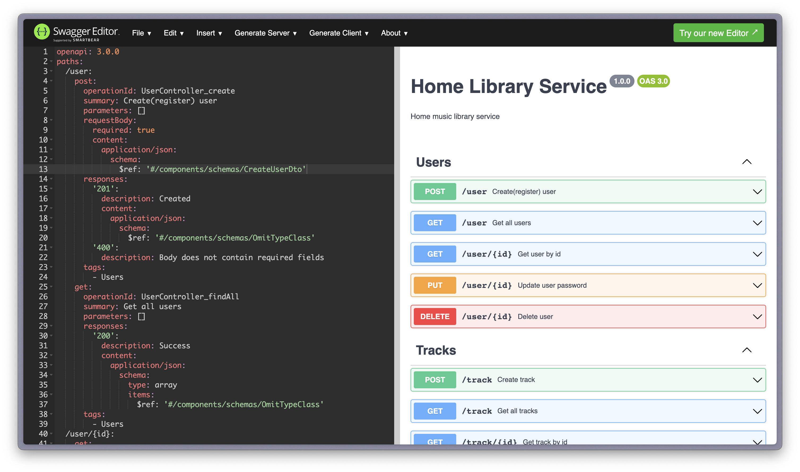

# Home Library Service

## Screenshot



# How to run application in Docker container

## Prerequisites

- Git - [Download & Install Git](https://git-scm.com/downloads).
- Node.js - [Download & Install Node.js](https://nodejs.org/en/download/) and the npm package manager. (Use 18 LTS version of Node.js)
- Install [Docker](https://docs.docker.com/engine/install/)

## Clone repo

```
git clone https://github.com/lgklsv/nodejs2023Q2-service.git
```

## Install NPM modules

```
npm install
```

## Create .env file

```
.env file should be at the top level and exactly the same as .env.example
```

## Run application with docker-compose

#### Pull and build the application inside docker container

```
docker-compose up -d --build
```

#### If you've already done build process just start docker container with

```
docker-compose up -d
```

#### To stop docker container use

```
docker-compose down
```

## To check application image for vulnerabilities (docker should be installed)

```
npm run scout
```

## Testing

After application running open new terminal and enter:

To run all test with authorization

```
npm run test:auth
```

To run only specific test suite with authorization

```
npm run test:auth -- <path to suite>
```

## Logs

In .env file you can change logger level e.g level 0 will write only errors,  level 4 writes all logs.

Also you can configure max logs file size.

```
LOGGER_LEVEL=4
LOGGER_FILE_SIZE=1024000 # 1mb
# LOGGER_FILE_SIZE=1024 You can use smaller file size to test rotation
```


### Auto-fix and format

```
npm run lint
```

```
npm run format
```

## Swagger

After starting the app on port (4000 as default) you can open
in your browser OpenAPI documentation by typing http://localhost:4000/doc/.
For more information about OpenAPI/Swagger please visit https://swagger.io/.
There is also my generated yaml file in `/doc` folder `my-swagger-api.yaml`. You can open it using yaml option on https://editor.swagger.io/.

## Application image on Docker Hub

https://hub.docker.com/layers/lgklsv/home-library-service-api/latest/images/sha256:1f1786c5b591c3b5186bfd0b09be4fe2b20f114d81289d74ebb82e7bb1787cc2

### Debugging in VSCode

Press <kbd>F5</kbd> to debug.

For more information, visit: https://code.visualstudio.com/docs/editor/debugging
